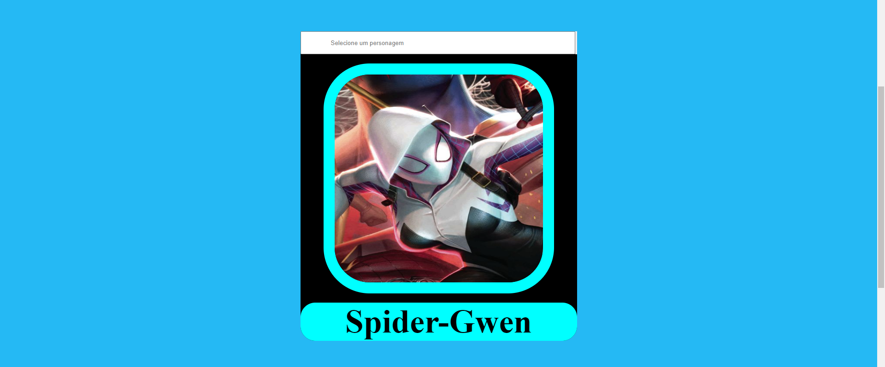

# DS2M - A - Gustavo Prevelate Ribeiro Da Silva

---

# Portfólio
---

[Clique aqui](https://dc-marvel-atualizado.vercel.app/) para visitar o site.

---

### Sobre esse site:

Site desenvolvido para colocar os conhecimentos obtidos no curso do [SENAI Jandira](https://jandira.sp.senai.br/) em prática, com criação de componentes em javaScript, o uso de rotas para navegação do site e fazendo a utilização de uma API pública.

---
## Tecnologias

- HTML
- CSS
- Markdown
- Responsividade
- JavaScript
- Web Components

---
## Itens Adicionais

- Figma

[Clique aqui](https://www.figma.com/file/OlWHqaiaT2YDRFA0ZpUERf/SuperHeroes---API?type=design&node-id=0-1&t=coGoNwKfCa79qYZx-0) para visitar o Figma.

---
## Relatório do LightHouse
O LightHouse basicamente analisa todo o seu site, indicando como está determinados aspectos do mesmo. Segue o relatório:

---
## Equipe
- [Gustavo Prevelate Ribeiro Da Silva](https://github.com/GustavoPrevelate)

# Critérios de Avaliação

- [ ]  Documentou problemas, se encontrado, para futuras consultas?
- [x]  Foi criado o layout no figma?
- [x]  A página foi construída seguindo o planejado no Figma?
- [x]  A página funciona em dispositivos diferentes?
- [x]  Foi consumida a API escolhida?
- [x]  Foi criado web componentes?
- [x]  Foi criado um padrão de roteamente para as paginas?
- [x]  As funções foram criadas seguindo à boa prática de responsabilidade única?
- [x]  Quando possível, foi criado funções puras?
- [x]  O projeto está publicado?
- [x]  Foi criado o arquivo README.md?

---